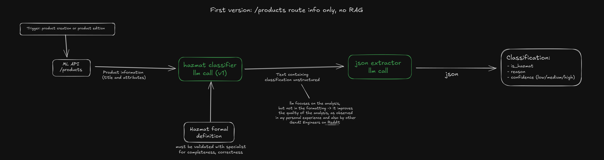
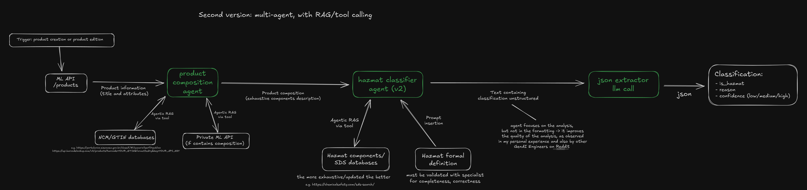

# Hazmat Classifier

A modular and reproducible pipeline for classifying products as hazardous materials (Hazmat) using Large Language Models (LLMs).

## Table of Contents

- [Overview](#overview)
- [Architecture](#architecture)
- [Workflow](#workflow)
- [Directory Structure](#directory-structure)
- [Installation](#installation)
- [Configuration](#configuration)
  - [Configuring LLM API Keys](#configuring-llm-api-keys)
- [Usage](#usage)
  - [Running the Full Pipeline](#running-the-full-pipeline)
  - [Skipping Stages](#skipping-stages)
  - [Customizing the Dataset](#customizing-the-dataset)

## Overview

This project provides a complete pipeline to:

1.  **Collect product data** from Mercado Livre using a combination of scraping and their official API.
2.  **Process the raw data** into a structured format (CSV).
3.  **Classify products** as Hazmat or not using an LLM.

The pipeline is designed to be modular, configurable, and reproducible.

## Architecture

### Architecture V1 (Implemented)

This diagram illustrates the currently implemented architecture of the Hazmat Classifier pipeline.



### Architecture V2 (Proposed)

This diagram presents a proposed updated architecture for future enhancements.



## Workflow

The pipeline consists of three main stages:

1.  **Data Collection (`data_collection.py`):**
    - Scrapes product IDs from Mercado Livre search results based on a predefined list of queries.
    - Fetches detailed product information for each ID using the Mercado Livre API.
    - Saves the raw data as JSON files.

2.  **Data Processing (`data_processing.py`):**
    - Reads the raw JSON data.
    - Extracts relevant fields (ID, title, attributes).
    - Converts the data into a single CSV file.

3.  **Classification (`classification.py`):**
    - Reads the processed CSV file.
    - Sends product information to an LLM in batches.
    - The LLM classifies each product as Hazmat or not based on a provided definition.
    - Saves the classified data to a new CSV file, along with the LLM's reasoning and confidence level.

## Directory Structure

```
hazmat-classifier/
├── data/
│   └── dataset_1/
│       ├── products_ids/         # Raw product IDs (JSON)
│       ├── products_info/        # Raw product info (JSON)
│       ├── dataset_1.csv           # Processed product data
│       └── ...
├── notebooks/              # Notebooks that contain first version of implementation.
│                           # They were used for exploration, API tests and classifier 
│                           # implementation, later refactored to main.py 
│                           # (kept here for historical reference only)
├── src/
│   ├── __init__.py
│   ├── classification.py     # Product classification logic
│   ├── config.py             # Centralized configuration
│   ├── data_collection.py    # Data collection logic
│   └── data_processing.py    # Data processing logic
├── .env.example            # Example environment variables
├── main.py                 # Main script to run the pipeline
├── poetry.lock
├── pyproject.toml          # Project dependencies
└── README.md               # This file
```

## Installation

1.  **Clone the repository:**
    ```bash
    git clone https://github.com/your-username/hazmat-classifier.git
    cd hazmat-classifier
    ```

2.  **Install dependencies:**
    This project uses Poetry for dependency management.
    ```bash
    poetry install
    ```
    Alternatively, you can create a virtual environment and install the dependencies from `pyproject.toml`.

## Configuration

1.  **Environment Variables:**
    - Create a `.env` file by copying the example file:
      ```bash
      cp .env.example .env
      ```
    - Open the `.env` file and add your Mercado Livre API access token:
      ```
      ML_ACCESS_TOKEN="your-access-token"
      ```
    
    **How to obtain your Mercado Livre API access token:**
    
    - Create an account at [Mercado Livre Developers](https://developers.mercadolivre.com.br/pt_br/).
    - Create an application as described in [this guide](https://developers.mercadolivre.com.br/pt_br/crie-uma-aplicacao-no-mercado-livre).
    - After creating your application, follow the steps in [this video tutorial](https://www.youtube.com/watch?v=T2Q_CE8vqYM&t=53s) or the [official documentation](https://developers.mercadolivre.com.br/pt_br/autenticacao-e-autorizacao) to obtain your access token.
    - Copy the generated token and paste it into the `.env` file as shown above.

2.  **Pipeline Configuration (`src/config.py`):**
    - The `src/config.py` file contains all the configurable parameters for the pipeline, such as API endpoints, model names, file paths, and the list of search queries. You can modify this file to change the pipeline's behavior.

### Configuring LLM API Keys

To use LLM-based classification, you must provide API keys for your chosen LLM provider (e.g., OpenAI, Gemini, Groq, etc.). To use local LLMs, an API key is not needed, just use Ollama to serve the model and set the name of the model in `src/config.py` as `ollama/your-local-model-name`.

1. **Add your API key(s) to the `.env` file:**
   - For OpenAI:
     ```
     OPENAI_API_KEY="your-openai-api-key"
     ```
   - For Gemini:
     ```
     GEMINI_API_KEY="your-gemini-api-key"
     ```
   - For Groq:
     ```
     GROQ_API_KEY="your-groq-api-key"
     ```
   - (Add other providers as needed.)

2. **Environment variable usage:**
   - The pipeline and utility functions will automatically load these keys from the environment using `python-dotenv`.
   - Make sure your `.env` file is not committed to version control (it is already in `.gitignore`).

3. **Security:**
   - Never share your `.env` file or API keys publicly.
   - Use `.env.example` to document required variables for collaborators.

For more details, see the documentation for your LLM provider.

## Usage

The pipeline is executed through the `main.py` script.

### Running the Full Pipeline

To run all stages of the pipeline (data collection, processing, and classification), simply run:

```bash
python main.py
```

### Skipping Stages

You can skip specific stages using command-line arguments:

- `--skip-data-collection`: Skips the data collection stage.
- `--skip-data-processing`: Skips the data processing stage.
- `--skip-classification`: Skips the classification stage.

**Example:** Run only the classification stage:

```bash
python main.py --skip-data-collection --skip-data-processing
```

### Customizing the Dataset

You can specify a different dataset name and batch size for classification:

- `--dataset-name <name>`: Sets the name of the dataset directory (default: `dataset_1`).
- `--batch-size <size>`: Sets the batch size for classification (default: `1`).

**Example:** Run the classification on a dataset named `my_dataset` with a batch size of 50:

```bash
python main.py --skip-data-collection --skip-data-processing --dataset-name my_dataset --batch-size 50
```

